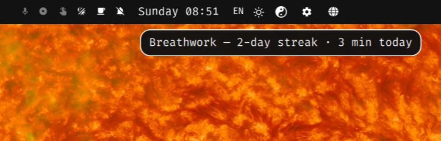
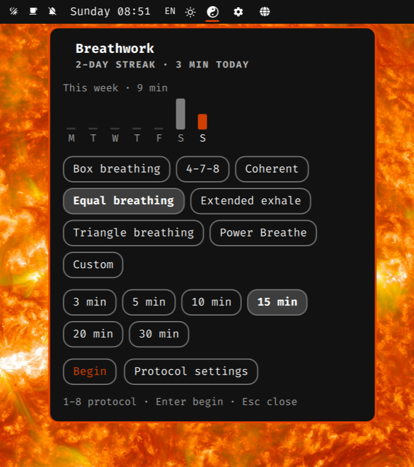
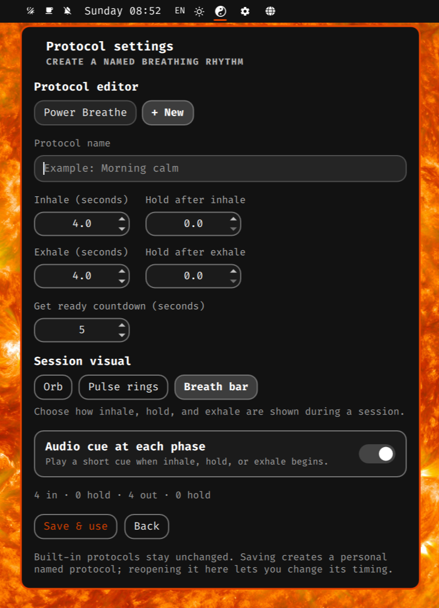
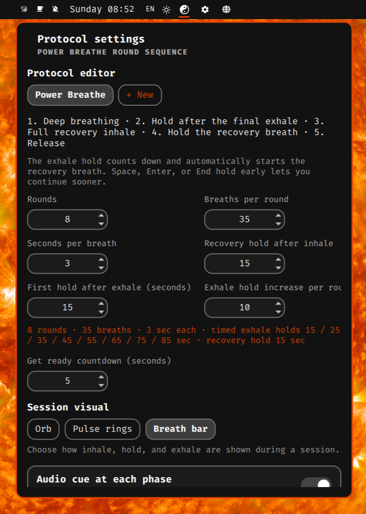

# Breathwork for Omarchy

A personal, customizable guided-breathing plugin for the Omarchy shell. It is
based on [Zen for Omarchy](https://github.com/ya-luotao/omarchy-zen) and keeps
the original MIT license.

The plugin provides a fullscreen visual breathing pacer, a bar widget, session
history, a daily streak, optional bells, and optional do-not-disturb mode.
Every inhale, hold, and exhale can begin with a short audio cue.
Every session also begins with a configurable **Get ready** countdown.

The session visual can be changed in **Protocol settings**. Choose the classic
expanding **Orb**, layered **Pulse rings**, or a vertical **Breath bar**. The
choice is saved and applies to every breathing protocol.

## Screenshots

**Bar icon and practice summary**



**Protocol selection and weekly practice history**



**Personal protocol editor, visuals, and audio settings**



**Power Breathe rounds and timed hold settings**



## Installation

Requires an Omarchy desktop with the Quickshell-based shell and `omarchy plugin`
commands, Git, and Python 3. Audio cues additionally need `pw-play` (PipeWire) or
`paplay`, plus the freedesktop sound files; visuals work without audio.

Install and enable from a terminal:

```bash
omarchy plugin add https://github.com/rolandjo/oma-breathwork.git --enable
```

The repository is currently private: your GitHub account must have access and
Git must already be authenticated. If you use an SSH key registered with GitHub,
use this URL instead:

```bash
omarchy plugin add git@github.com:rolandjo/oma-breathwork.git --enable
```

Choose a bar position if prompted. Omarchy installs the plugin under
`~/.config/omarchy/plugins/oma.breathwork/`. Verify it with:

```bash
omarchy plugin list
omarchy-shell oma.breathwork status
```

If already installed but disabled, enable it with:

```bash
omarchy plugin enable oma.breathwork
```

Click the yin-yang bar icon, choose a protocol, and press **Begin**. Right-click
the icon for settings. Read the [health disclaimer](#health-disclaimer-and-safe-use)
before starting, especially before using Power Breathe.

To update a clean installation from the repository:

```bash
omarchy plugin update oma.breathwork
```

Preserve any local code changes before updating. If the shell continues showing
old code after an update, run `omarchy restart shell` to reload it. Repository
installation and updates include only changes that have been committed and pushed.

## Protocols

Times below are seconds. The possible benefits are intended uses, not promises
of clinical effects. Gentle breathing exercises can help with stress, but that
does not establish a unique benefit for each exact timing ratio. Breathe
comfortably without forcing depth or duration. See the
[NHS breathing guidance](https://www.nhs.uk/mental-health/self-help/guides-tools-and-activities/breathing-exercises-for-stress/).

| Protocol / key | Description and default rhythm | Possible benefit or practical use |
|---|---|---|
| **Box breathing** (`box`) | Four equal phases: inhale 4, hold 4, exhale 4, hold 4. | A predictable counting structure for focusing attention and taking a calm break. |
| **4-7-8** (`478`) | Inhale 4, hold 7, exhale 8; emphasizes a long exhale. | A structured wind-down routine. It is not a proven treatment for insomnia; shorten uncomfortable holds in a personal copy. |
| **Coherent** (`coherent`) | Inhale 5.5, exhale 5.5, with no holds; approximately 5.5 breaths per minute. | Continuous slow pacing for relaxation and steady attention, without breath-hold pauses. |
| **Equal breathing** (`equal`) | Inhale 4, exhale 4, with no holds. | A simple rhythm that is easy to follow while learning to pace breathing. |
| **Extended exhale** (`extended`) | Inhale 4, exhale 6, with no holds. | A way to explore a longer, unforced exhale during a relaxing break. |
| **Triangle breathing** (`triangle`) | Inhale 4, hold 4, exhale 4; no hold after exhale. | A three-step focus exercise for people who prefer to omit the empty-lung pause. |
| **Power Breathe** (`power`) | Repeated breaths, timed exhale hold, recovery inhale and hold, then release. Settings control rounds, pace, and hold progression. | Guided counting and round tracking for a more intense practice. Benefits of this exact configurable sequence are not established; it has additional risks described below. |
| **Physiological Sigh** (`sigh`) | Inhale 3, top-up inhale 1 without exhaling, then exhale 6; no holds. | A physiological-sigh pattern for a brief calming practice; these timings are adjustable app defaults, not a medically prescribed ratio. |
| **Custom** (`custom`) | Default: inhale 4, hold 2, exhale 6, hold 0; adjustable timings. | Adapt the rhythm to comfortable durations, including removing holds. Custom timing is not medically validated. |
| **Named personal protocols** (`saved:…`) | Saved inhale, hold, exhale, and hold timings under a chosen name. | Reuse a preferred comfortable rhythm consistently without entering the settings again. |

Evidence for relaxation approaches varies by outcome; they should not replace
medical care. See [NCCIH's evidence and safety overview](https://www.nccih.nih.gov/health/relaxation-techniques-what-you-need-to-know).

Session choices in the panel are 3, 5, 10, 15, 20, and 30 minutes.
Power Breathe is round-based, so it uses rounds instead of the selected session
duration. Its dedicated settings editor lets you choose 1–20 rounds,
30–40 breaths per round, a 2–5 second breath pace, the first hold after exhale,
and how many seconds that exhale hold gains each round. The defaults produce
exhale holds of 10, 15, and 20 seconds. Each hold counts down and automatically
advances to the recovery inhale. Press **Space** or **Enter** (or choose
**End hold early**) to continue sooner. The recovery hold after inhale has its
own setting and stays the same on every round.

### Coherent breathing

Video reference: [Coherent breathing — reference video](https://www.youtube.com/watch?v=Vi0_7idqcFI).

The plugin preset uses a 5.5-second inhale and a 5.5-second exhale, with no holds.

### Physiological Sigh

Choose **Physiological Sigh** in the protocol selector. Follow the first inhale,
take a shorter second inhale without breathing out between them, then exhale
slowly. The visual expands in two steps and each step has its own audio cue.
The app repeats a 3-second inhale, 1-second top-up, and 6-second exhale for the
selected session duration. To change those timings, open **Protocol settings**,
edit **Inhale**, **Second inhale**, and **Exhale**, and save a named version.
Setting the second inhale to zero disables that extra phase in personal protocols.

Video reference: [Physiological Sigh — reference video](https://www.youtube.com/watch?v=kSZKIupBUuc).
[Stanford Medicine describes the physiological sigh](https://med.stanford.edu/news/insights/2020/10/how-stress-affects-your-brain-and-how-to-reverse-it)
as two nasal inhales followed by an extended mouth exhale. The numeric timings
above are this plugin's pacing choices. Keep the breaths comfortable and stop
if you feel unwell; see the disclaimer below.

## Health disclaimer and safe use

**Breathwork is a wellness pacing tool, not a medical device or medical advice.**
It does not diagnose, treat, cure, or prevent disease and does not monitor your
oxygen levels, heart rhythm, or ability to hold your breath. Neither defaults nor
maximum settings establish a safe duration for you. Do not change prescribed
treatment or delay professional care because of this plugin.

- Practice in a safe, comfortable seated or lying position. Never use breath-hold
  or intensive breathing exercises while driving, operating machinery, standing,
  swimming, bathing, or in/near water.
- Keep breathing comfortable. Do not force a breath or hold to finish a countdown,
  increase a streak, or reach a longer time. Press **Esc** to stop; during Power
  Breathe's exhale hold, **Space**, **Enter**, or **End hold early** advances sooner.
- Stop and resume normal breathing if you feel dizzy, faint, distressed, or unwell.
  Seek medical help for concerning or persistent symptoms; severe chest pain,
  severe breathing difficulty, or loss of consciousness needs urgent attention.
- Ask a qualified healthcare professional about suitability if you have a medical
  condition or a history of adverse reactions to breathing exercises. Relaxation
  practices can occasionally worsen anxiety or symptoms associated with some
  psychiatric conditions or trauma. [NCCIH safety guidance](https://www.nccih.nih.gov/health/relaxation-techniques-what-you-need-to-know).

### Additional caution for Power Breathe

Power Breathe is inspired by the Wim Hof breathing sequence, but this plugin is
not affiliated with or endorsed by the Wim Hof Method. Its automatic, progressively
longer exhale holds are a customization: the official instructions instead say to
resume breathing when the urge returns. **Your need to breathe takes priority
over the timer.** Intensive breathing and retention can cause fainting; use a safe
seated or lying position and never combine this exercise with water activities.
See the [official breathing instructions and warnings](https://www.wimhofmethod.com/breathing-exercises).

Avoid Power Breathe during pregnancy or with epilepsy. Seek medical guidance
before considering it if you have cardiovascular disease, a history of stroke or
fainting, significant respiratory illness, or other serious health concerns.
The [Wim Hof Method FAQ](https://www.wimhofmethod.com/faq) lists further exclusions,
including coronary disease, medicated high blood pressure, and recent surgery.
Its advice covers the broader method; it does not validate this plugin's custom
settings. Children should not use intensive breathing or retention unsupervised.

## Named personal protocols

Open the bar widget and choose **Protocol settings**, or right-click the bar
icon to open the settings panel directly. It lets you:

- start a new protocol from the timing of the currently selected protocol;
- give it a name;
- set inhale, hold-after-inhale, exhale, and hold-after-exhale durations;
- save it and select it as the default;
- reopen a saved protocol to rename it or change its timing;
- delete a saved protocol with a two-step confirmation.

Named protocols are stored in
`~/.local/state/omarchy/breathwork/protocols.json`. Built-in protocols remain
unchanged and can be used as templates for personal versions.

## Local data

Practice history is stored at `~/.local/state/omarchy/breathwork/stats.json`.
Named protocols are stored in the same directory as `protocols.json`. Back up
this directory to preserve your history and personal protocols.

## Custom rhythm

The default custom rhythm is 4 seconds in, 2 seconds held, 6 seconds out, and
no hold after the exhale. Change it with:

```bash
omarchy bar set oma.breathwork customIn 4
omarchy bar set oma.breathwork customHoldIn 2
omarchy bar set oma.breathwork customOut 6
omarchy bar set oma.breathwork customHoldOut 0
omarchy bar set oma.breathwork pattern custom
```

The named-protocol editor accepts phase durations in 0.1-second steps up to
30 seconds. Inhale and exhale require at least 1 second; holds may be zero.
Copying Coherent preserves its 5.5-second phases.

## Other settings

```bash
omarchy bar set oma.breathwork minutes 10
omarchy bar set oma.breathwork getReadySeconds 5
omarchy bar set oma.breathwork visualStyle rings
omarchy bar set oma.breathwork powerRounds 3
omarchy bar set oma.breathwork powerBreaths 30
omarchy bar set oma.breathwork powerBreathSeconds 3
omarchy bar set oma.breathwork powerRecoveryHold 10
omarchy bar set oma.breathwork powerRetentionHold 10
omarchy bar set oma.breathwork powerRetentionIncrease 5
omarchy bar set oma.breathwork bell false
omarchy bar set oma.breathwork phaseCues false
omarchy bar set oma.breathwork dnd false
```

Phase cues are enabled by default and can also be changed in **Protocol
settings**. With a countdown, the session bell marks **Get ready** and the
first inhale receives the ordinary phase cue. With no countdown, the session
bell serves as the first inhale cue so two sounds do not overlap.

The get-ready countdown is also configured in **Protocol settings**, applies
to every protocol, and accepts 0–30 seconds. It runs before practice timing
starts, so it does not reduce the selected session length.

## Commands

```bash
omarchy-shell oma.breathwork start extended 5
omarchy-shell oma.breathwork start power 5
omarchy-shell oma.breathwork status
omarchy-shell oma.breathwork settings
omarchy-shell shell summon oma.breathwork '{"pattern":"custom","minutes":5,"customIn":4,"customHoldIn":2,"customOut":6,"customHoldOut":0}'
```

## Keybinding

Add this to `~/.config/hypr/bindings.lua` if you want a direct shortcut:

```lua
o.bind("SUPER + SHIFT + B", "Breathwork",
  [[omarchy-shell shell summon oma.breathwork '{"pattern": "custom", "minutes": 10}']])
```

## License

MIT. Based on Zen for Omarchy by Luo Tao.

## Development checks

Run from the repository directory:

```bash
node tests/model.test.cjs
python3 -B tests/test_persistence.py
bash tests/run-qml.sh
omarchy plugin validate .
```

The QML runtime check requires an active Wayland session, Quickshell, and the
installed Omarchy shell components. It uses temporary data and keeps the
breathing overlay hidden. Node.js is needed only for model tests. Persistence
uses Python 3's standard library, locked updates, and atomic file replacement;
failed saves are reported and corrupt existing files are preserved.
